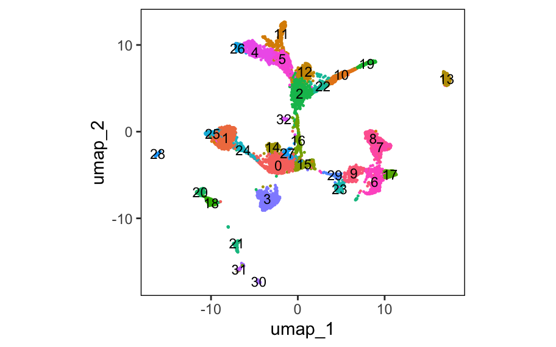
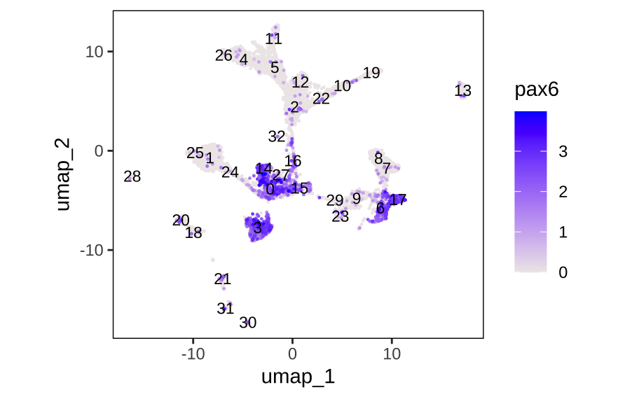

# Catullus </a>
A collection of useful functions for scRNA-seq analysis, meant to be utilized with tiledbsoma experiment objects.

## Installation
The package requires the `tiledbsoma` package be installed. See [this repository](https://github.com/single-cell-data/TileDB-SOMA/tree/main/apis/r) for details on this installation. Once this dependency is installed, one can install `Catullus` as follows: 
```
remotes::install_github("ccnawrocki/Catullus")
```

## Usage
There are three function types in `Catullus`: `Do`, `View`, and `Get`. 
- A `Do` function performs an operation or test.
- A `View` function creates a plot.
- A `Get` function simply retrieves something for future use.

## Reference
Here is a list of all the functions included in `Catullus`:
```
DoDETesting
DoPseudobulkAggregation
ViewDETesting
ViewMeta
ViewExpression
GetObjectSchema
GetGeneData
GetCellGroupIDs
GetDimRedData
GetMetaData
GetExpressionData
```

## Quickstart Vignette
The following vignette uses a subset of the data from [Briggs et al. 2018](https://pubmed.ncbi.nlm.nih.gov/29700227/).

First, open the `tiledbsoma` experiment object and check the schema. 
```
experiment <- tiledbsoma::SOMAExperimentOpen("briggs_data_stage22_SOMA")
GetObjectSchema(experiment)
```

Examining the schema (not shown), we see that louvain clustering was performed on this data and that the results are saved in the metadata in the `"louvain_33_clusters"` column. Let's look at the UMAP, labeling the clusters. 
```
Catullus::ViewMeta(exp_object = experiment, color_var = "louvain_33_clusters", labeling = T, legend = F)
```
</a>

Now, let's look again at the UMAP, but let's see which clusters express a known gene of interest, *pax6*.
```
Catullus::ViewExpression(exp_object = experiment, genes = "pax6", label_var = "louvain_33_clusters")
```
</a>

See the `.Rmd` files in the `vignettes` folder for more detailed usage examples. 
